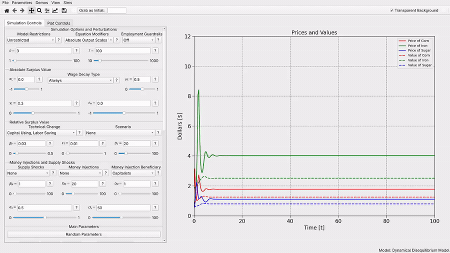

# Overseer (Formerly Dr. Creiner's Modelling Tools)

Overseer is a model visualization and exploration toolkit. Create Desmos-style interfaces quickly and easily for models of all kinds. Simulation PDE's? Running agent-based simulation? No problem! All you need to do is declare your system parameters, make a single Python function which executes the simulation and returns a dictionary of the plots you want to display, and write up a small yaml file declaring the controls you want to have. The tools will handle the rest and create a display of all of your plots so that you can edit your parameters and view the results in real time. 

# Installation
This software was primarily developed for the visualization of a few specific models which I am currently writing papers for. If you are just trying to use the accompanying software to those papers, special releases are available for you which can be simply downloaded and ran to display the relevant model. Just click the appropriate link in the section directly below this one. If you are interested in interacting directly with the tools yourself and making alterations or building your own models, see the instructions below that.

## Special Releases for Accompanying Papers

- [For my upcoming paper titled 'Empirical Redemption of Marx's Law of the TEndential Fall in the Rate of Profit Within Dynamic Cross-Dual Disequilibrium Models, click here](https://github.com/alexbcreiner0/Modeling-Tools/releases/tag/v1.0.0)
   - [The paper (currently in pre-publishing](https://www.alexcreiner.com/documents/rate-of-profit-paper.pdf)
 
## General Releases
[See the latest releases page for instructions](https://github.com/alexbcreiner0/Modeling-Tools/releases).

## Running Locally
If you don't want to go with the official release route, it's easy to run the project directly:
- Install [https://www.python.org/](Python) if you don't have it, make sure you check the 'add to system path' checkbox in the process if you are a Windows user.
- Clone the repo onto your computer (either by opening up a terminal and typing `git clone https://github.com/alexbcreiner0/Modeling-Tools.git` (must have git installed) or by downloading and extract the zip folder (found by clicking the green code button))
- Open up a terminal, navigate inside the folder to the folder:
```
cd Modeling-Tools
```
- (Optional but recommended) Create and enter a virtual environment:
```
python -m venv modeling_tools_venv
source venv/bin/activate
```
- Install the package:
```
pip install -e .
```
- Then run the package
```
python -m modeling_tools
```
